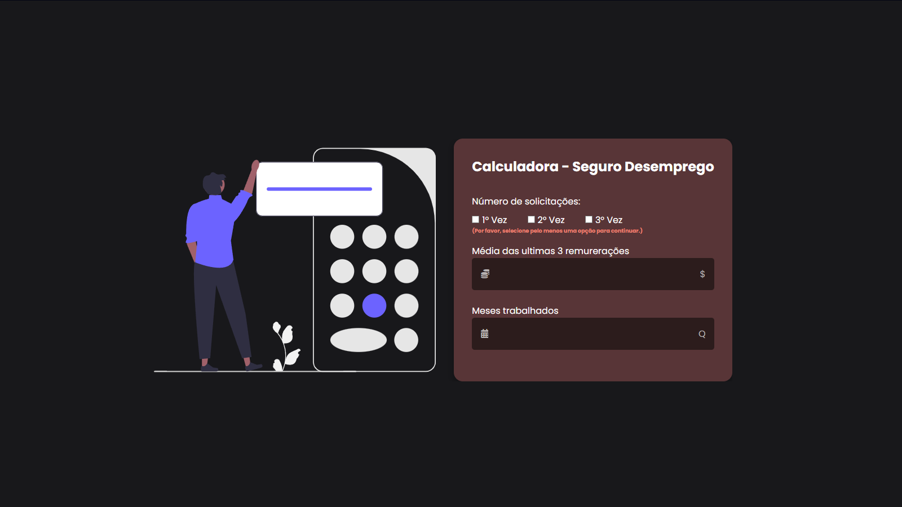
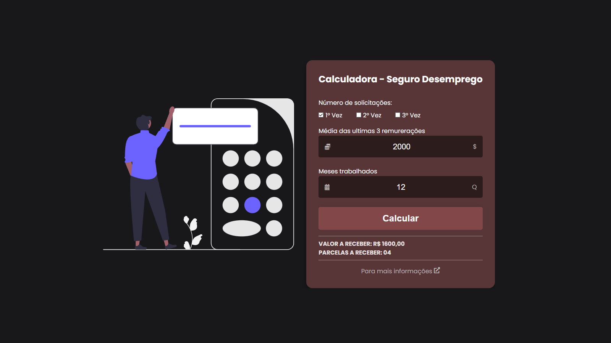
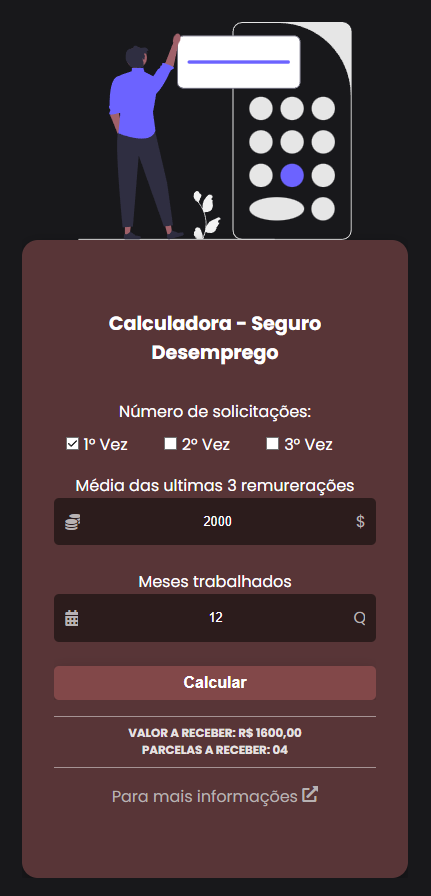

# Calculadora Seguro Desemprego

Este projeto é uma Calculadora Seguro Desemprego para pessoas demitidas sem justa causa, serve para calular o valor das parcelas e quantas parcelas ela vai receber.

## Índice

- [Visão Geral](#visão-geral)
  - [O Desafio](#o-desafio)
  - [Captura de Tela](#captura-de-tela)
  - [Links](#links)
- [Meu Processo](#meu-processo)
  - [Tecnologias Utilizadas](#tecnologias-utilizadas)

## Visão Geral

### O Desafio

Os usuários devem ser capazes de:

- Ver o layout ideal dependendo do tamanho da tela do dispositivo
- Ver estados de hover para elementos interativos
- Fazer calculos simples.

### Captura de Tela

Desktop

Mobile

### Links

- URL do Site ao Vivo: [GitHub Page](https://leandro-mathiask.github.io/projeto-calculadora-sd/)

## Meu Processo

### Tecnologias Utilizadas

- Marcações HTML5 semântica
- Propriedades CSS personalizadas
- Flexbox
- CSS
- JavaScript
